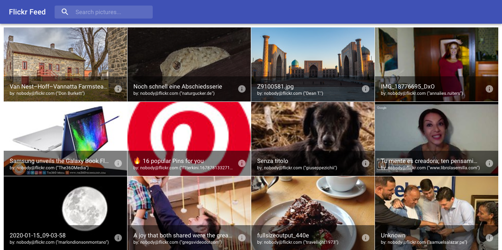
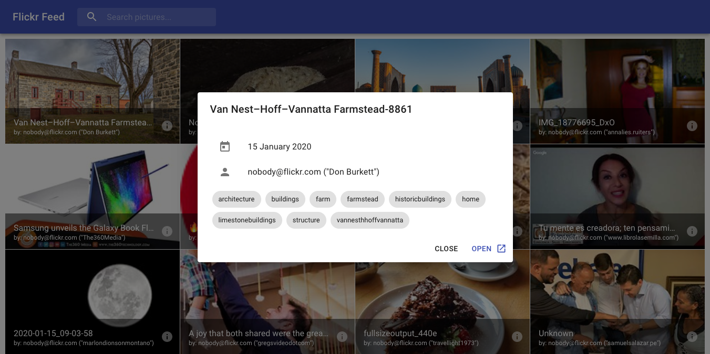

# flickr-api-react

[`flickr-api-react`](https://flickr-api-react.netlify.com/) is a simple React project to display the photos from the [Flickr public feed](https://www.flickr.com/services/feeds/docs/photos_public/) and allows searching them by tags.

This is my first React app and was a way of learning React while building a concrete project.

This project was bootstrapped with [Create React App](https://github.com/facebook/create-react-app).

> :warning: **Some of the photos might be NSFW**: No filtering is done on the feed.

 
 

## Available Scripts

In the project directory, you can run:

### `yarn start`

Runs the app in the development mode. 
Open [http://localhost:3000](http://localhost:3000) to view it in the browser.

The page will reload if you make edits. 
You will also see any lint errors in the console.

### `yarn test`

Launches the test runner in the interactive watch mode. 
See the section about [running tests](https://facebook.github.io/create-react-app/docs/running-tests) for more information.

### `yarn build`

Builds the app for production to the `build` folder. 
It correctly bundles React in production mode and optimizes the build for the best performance.

The build is minified and the filenames include the hashes. 
Your app is ready to be deployed!

See the section about [deployment](https://facebook.github.io/create-react-app/docs/deployment) for more information.

## Development Process

### UI Design

To keep development as simple as possible while still having a nice UI & UX, I've leveraged the popular [Material-UI framework](https://material-ui.com/).

The layout is composed of:
* A `<NavBar>` component which is an [App Bar](https://material-ui.com/components/app-bar/) that contains the title and a search field.
* A `<PhotoList>` which is a [Grid List](https://material-ui.com/components/grid-list/#grid-list) which display the photos tiles.
* Each `<PhotoTile>` displays the thumbnail, title and author of the photo as well as an info button which displays additional info in a `Dialog` when clicked.

### Flickr Public Feed

To avoid having dealing with CORS issues, the data is fetched using JSONP with the [`fetch-jsonp`](https://github.com/camsong/fetch-jsonp) library.
